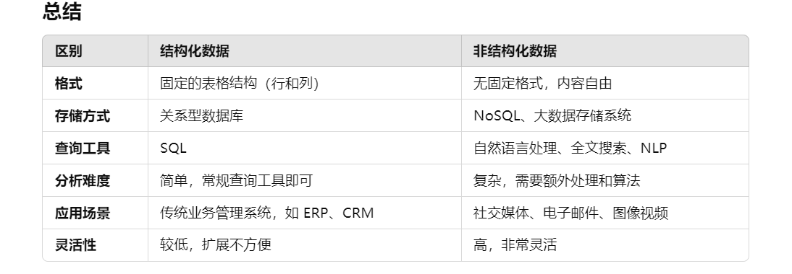

# elementUI3.0 右边标签是废弃的版本

# localStorage 大概存 5-10 MB

数据过大报错，尝试压缩数据：
npm install lz-string
let jsonString = JSON.stringify(row);
let compressedData = LZString.compress(jsonString);
localStorage.setItem('myRow', JSON.stringify(compressedData));
加压缩：
let row = localStorage.getItem('myRow');
let decompressedData = LZString.decompress(row);
问题：
js压缩大量数据可能会阻塞主线程，从而导致糟糕的用户体验，当数据大小超过 5-10 MB 时，速度会明显减慢或崩溃.(还是不适合存视频文件)

# bob流 对应base64 header.startsWith('FF D8 FF') header.startsWith('1A 45 DF A3') header === '00 00 00 18'

startsWith() 不能直接同时匹配两个条件，但你可以通过逻辑运算符 ||
jpeg FF D8 FF ：/9j/
png 89 50 4E 47 ：iVBORw
gif 47 49 46 38 ：R0lG
mp4 00 00 00 18 ：AAAAEAh
webm 1A 45 DF A3 ： GkRWoA==

# 视频加载 https://zhuanlan.zhihu.com/p/140677100

HTML5里video标签支持： Ogg、MPEG4、WebM
比如MP4格式，MP4只是一个容器，里面还有一个叫编码器的东西。格式虽然都是MP4但是html中只支持H.264的编码格式。所以要用软件来转码
MP4 = MPEG 4文件使用 H264 视频编解码器和AAC音频编解码器
WebM = WebM 文件使用 VP8 视频编解码器和 Vorbis 音频编解码器
Ogg = Ogg 文件使用 Theora 视频编解码器和 Vorbis音频编解码器

# 视频转base64

Base64 文件大小比原视频大了约 33%
cmd：
PS D:\Chrome\download> [Convert]::ToBase64String([System.IO.File]::ReadAllBytes("11.mp4")) > output.txt
使用“1”个参数调用“ReadAllBytes”时发生异常:“该文件太长。此操作当前仅限于支持大小小于 2 GB 的文件。”
js:
const fs = require('fs');
const video = fs.readFileSync('input_video.mp4');
const base64 = video.toString('base64');
fs.writeFileSync('output.txt', base64);
使用：
<video controls>

  <source src="data:video/mp4;base64,AAA..." type="video/mp4">
</video>

# 西瓜播放器3.0 最新版css 换成

import "xgplayer/dist/xgplayer.css";

# 截图功能

screenShot: {
saveImg: true,
quality: 0.92,
type: 'image/png',
format: '.png'
},
截图没问题 url: xg,//导入本地视频
截图出错 url: "//lf9-cdn-tos.bytecdntp.com/cdn/expire-1-M/byted-player-videos/1.0.0/xgplayer-demo.mp4",
报错：Uncaught (in promise) SecurityError: Failed to execute 'toDataURL'
原因：受跨源数据污染的画布元素使用该toDataURL方法时。当您尝试截取来自不同来源（例如不同的域、协议或端口）的视频内容的屏幕截图时，可能会发生这种情况。//前端服务是http://localhost:3000,视频地址是：https://...

# vue3 prop

const post = {//父组件传值
id: 1,
title: 'My Journey with Vue'
}
<BlogPost :id="post.id" :title="post.title" />
// 子组件
const { foo } = defineProps(['foo'])//v2之前props 需要多加一个watch监听来保证props 实时更新数据

watchEffect(() => {
// 在 3.5 之前只运行一次
// 在 3.5+ 中在 "foo" prop 变化时重新执行
console.log(foo)
})
toRef(props, 'mediaId')创建了一个对props.mediaId的引用,它实际上是对props对象中现有属性的一个绑定.因此修改无效,父子响应式
ref(props.mediaId)创建了一个新的响应式ref，它与props.mediaId没有绑定关系.因此可以修改，父子非响应式
区别：
watchEffect() 用于侦听并执行副作用，比如在某些属性变化时执行某个逻辑。即执行函数
toRef() 用于创建可响应的单一引用，简化模板或代码中对 props 的使用。即单一属性变化

# 如果你在代码中明确地使用了 autoIncrement: true，但是对象存储仍然显示 autoIncrement: false，可能是以下几个原因导致的：

IndexedDB 一旦创建了数据库和对象存储，如果你没有改变版本号，后续的 onupgradeneeded 事件不会再次触发，导致旧的配置一直存在。

1.修改const DB_VERSION = 2;（未解决）2.删除旧的 IndexedDB 数据库：（解决）
打开 浏览器开发者工具，选择 Application 标签页。
在 IndexedDB 选项卡中，右键点击你的数据库名，选择 Delete Database

# indexDB.addData

function rowClick(row) {
indexDB.addData(row) //row 不是个普通的对象 存indexDB报错
}
报错： DataCloneError: Failed to execute 'add' on 'IDBObjectStore': #<Object> could not be cloned.
用于JSON.parse(JSON.stringify())深度克隆
此方法可确保您仅保留可序列化的数据并删除任何反应性、循环或不可序列化的属性
let plainRow = JSON.parse(JSON.stringify(row));//重要 深度克隆
let { medias, author, authorUrl, content, imageUrl, publishDate, url } = plainRow;
let obj = { medias, author, authorUrl, content, imageUrl, publishDate, url };

# 加载视频

  <video :src="'data:video/mp4;base64,' + media" controls>
    Your browser does not support the video tag.
  </video>

# base64 视频太大用响应属性接页面直接奔溃

办法：使用非响应属性，接到数据再去渲染 dom

 0">

// 从数据库获取数据
indexDB.getData(idLeng).then((data) => {
console.log(`${idLeng}-的数据:`, data);
let { title, author, authorUrl, content, imageUrl, publishDate, url } = data;
rowData.value = { title, author, authorUrl, content, imageUrl, publishDate, url }//响应数据
// rowData.value = data//直接赋值页面奔溃
mediaList = data.medias//非响应
videoElement.style.display = 'block'; // 显示视频
});

# 结构化和非结构化数据类型之间的区别

非结构化数据 数据库：MongoDB、Cassandra、Redis、CouchDB、HBase、Neo4j、Amazon DynamoDB、Elasticsearch、Riak
非结构化数据 服务器：Minio是一个非常适合存放非结构化数据的工具,非常适合于存储大容量的非结构化数据，如图片、视频、日志文件、备份数据和容器/虚拟机镜像等。Minio支持的对象文件大小可以从几kb到最大5T不等，这使得它能够满足各种规模的数据存储需求。Minio的服务器足够轻量，可以很容易地与其他应用程序结合使用，类似于NodeJS、Redis或MySQL。
